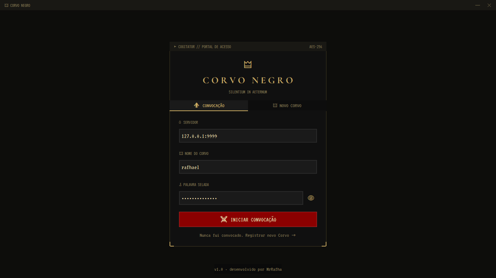
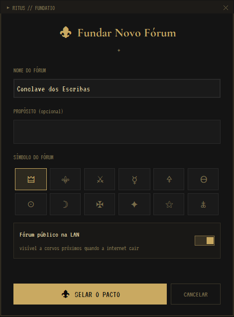
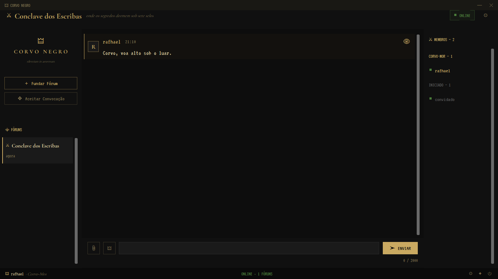
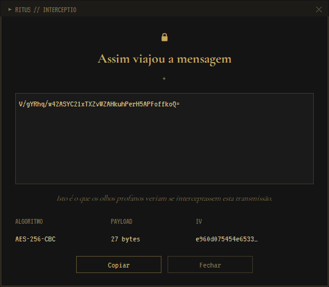
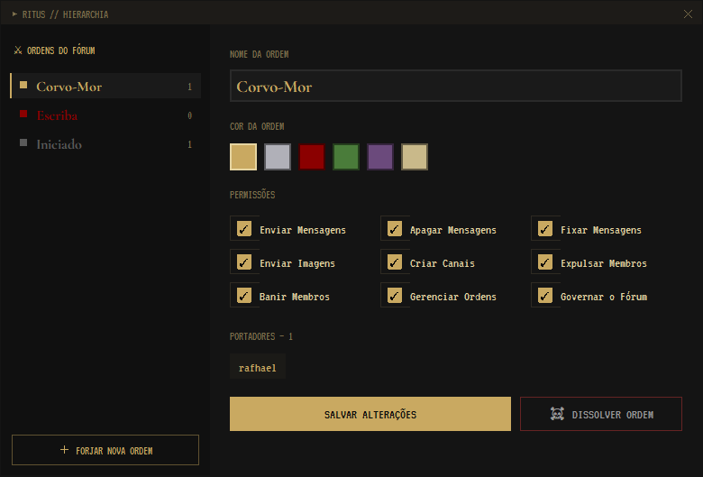
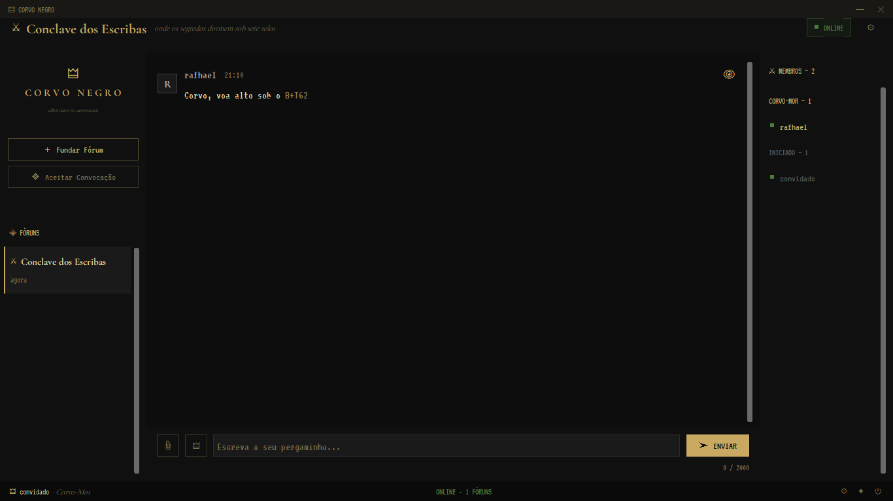

# 🜲 Corvo Negro

> *"As palavras dos mortos viajam em asas negras. Nenhum ouvido profano as escutará."*

**Fórum criptografado ponta a ponta com suporte híbrido LAN + Online.** Comunicação segura entre múltiplos usuários, salas privadas com controle de permissões, e resiliência a quedas de rede via modo LAN autônomo.


---

## ⚜ Sobre

Corvo Negro é um sistema de mensageria criptografada desenvolvido como projeto final da disciplina de Segurança da Informação. Combina três camadas de proteção — autenticação com hash, troca de chaves assimétrica e criptografia simétrica de sessão — para garantir que **nem mesmo o servidor** consiga ler as mensagens dos usuários.

Diferente de sistemas convencionais, o Corvo Negro opera em dois modos:

- **Modo Online:** conexão TCP centralizada com um servidor de roteamento
- **Modo LAN:** quando a internet cai, os clientes na mesma rede local se descobrem automaticamente e continuam trocando mensagens em uma mesh peer-to-peer criptografada. Ao voltar online, o histórico é sincronizado.

---

## 🗡 Funcionalidades

### Segurança
- 🔐 **Autenticação SHA-256 + PBKDF2** com salt único por usuário
- 🔑 **Troca de chaves RSA-2048** com padding OAEP
- 🔒 **Criptografia AES-256-CBC** em todas as mensagens
- 🎭 **Criptografia ponta a ponta em grupo** — chave AES por fórum, cifrada com a chave pública de cada membro
- 🗝 **Histórico local cifrado** com chave derivada da senha do usuário (PBKDF2)
- 👁 **Visualizador de cifra** — inspecione o texto criptografado de qualquer mensagem

### Comunicação
- 💬 **Múltiplos fóruns** — crie salas privadas ilimitadas
- 🎟 **Convites por hash** — códigos legíveis (`CORVO-XKJH-2847`) que nunca são armazenados em claro no servidor
- ⚔ **Roles customizáveis** — crie funções com permissões granulares por fórum
- 🖼 **Múltiplos clientes simultâneos** — servidor threaded aceita N conexões
- 📌 **Fixação de mensagens** e moderação por permissão

### Resiliência
- 🌐 **Modo LAN autônomo** — descoberta via mDNS/Zeroconf
- 🔄 **Sync automático** ao reconectar à internet
- 📜 **Cache local persistente** de todo o histórico

---

## 🖼 Screenshots

| | |
|---|---|
|  |  |
| Portal de acesso (login/registro) | Fundação de fórum com símbolo customizável |
|  |  |
| Chat com histórico e sidebar de membros | Visualizador de cifra — ciphertext AES-256-CBC real |
|  |  |
| Gerenciador de ordens (roles) e permissões | Animação de decodificação (hash → texto revelando) |

---

## ⚔ Arquitetura

```
┌───────────────────────────────────────────────────────────────┐
│                     MODO ONLINE (Internet)                     │
│                                                                │
│   ┌──────────┐         ┌─────────────┐         ┌──────────┐   │
│   │ Cliente  │ ◀─TCP──▶│  Servidor   │ ◀─TCP──▶│ Cliente  │   │
│   │    A     │         │  Roteador   │         │    B     │   │
│   └──────────┘         └─────────────┘         └──────────┘   │
│                              ▲                                 │
│                              │                                 │
│                              ▼                                 │
│                        ┌──────────┐                            │
│                        │  SQLite  │ (mensagens cifradas)       │
│                        └──────────┘                            │
└───────────────────────────────────────────────────────────────┘
                                │
                                │ (falha de conexão)
                                ▼
┌───────────────────────────────────────────────────────────────┐
│                       MODO LAN (Offline)                       │
│                                                                │
│         ┌──────────┐                    ┌──────────┐          │
│         │ Cliente  │ ◀──── mesh ──────▶ │ Cliente  │          │
│         │    A     │       TCP P2P       │    B     │          │
│         └────┬─────┘                    └─────┬────┘          │
│              │                                │                │
│              └────────► Cliente C ◀──────────┘                │
│                     (mDNS discovery)                           │
│                                                                │
│  Cache local ────► Sync ao voltar online ────► Merge histórico │
└───────────────────────────────────────────────────────────────┘
```

### Fluxo criptográfico de uma mensagem

```
1. Remetente digita: "Corvo, voa alto"
2. Cliente cifra com AES-256-CBC (chave do fórum) → ciphertext
3. Envia via TCP ao servidor: { forum_id, ciphertext, iv, sender }
4. Servidor armazena o ciphertext (sem conseguir ler)
5. Servidor rotea para membros online do fórum
6. Cada destinatário decifra localmente com sua chave AES do fórum
```

O servidor **jamais** tem acesso ao conteúdo em claro. A chave AES do fórum foi entregue a cada membro cifrada com RSA — e cada membro só consegue decifrar com sua chave privada, que nunca sai do dispositivo.

---

## 🏛 Stack

| Camada | Tecnologia |
|---|---|
| Linguagem | Python 3.11+ |
| Criptografia | `cryptography` (RSA, AES, PBKDF2, SHA-256) |
| Rede | `socket` (TCP puro), `threading` |
| Descoberta LAN | `zeroconf` (mDNS) |
| Interface | `customtkinter` |
| Persistência | SQLite via `sqlite3` |
| Testes | `pytest` |

---

## 📜 Instalação

### Pré-requisitos
- Python 3.11 ou superior
- pip

### Servidor

```bash
git clone https://github.com/MrRafha/Corvo-Negro.git
cd Corvo-Negro/server
python -m venv venv
source venv/bin/activate  # Linux/Mac
venv\Scripts\activate     # Windows
pip install -r requirements.txt
python main.py
```

O servidor sobe em `0.0.0.0:9999` por padrão. Configure porta e host em `server/config.py`.

### Cliente

```bash
cd Corvo-Negro/client
python -m venv venv
source venv/bin/activate  # Linux/Mac
venv\Scripts\activate     # Windows
pip install -r requirements.txt
python main.py
```

Na primeira execução, configure o IP do servidor na tela de login (ou deixe em branco para modo LAN puro).

---

## 🎭 Como usar

### Primeiro acesso

1. Abra o cliente e clique na aba **"🜲 NOVO CORVO"** para registrar-se
2. Escolha um nome de usuário e senha (a senha nunca sai do seu dispositivo em claro)
3. Faça login

### Criar um fórum

1. Clique em **"＋ Fundar Fórum"** na sidebar
2. Dê um nome ao fórum (ex: "Conclave dos Escribas")
3. Um código de convite será gerado: **compartilhe apenas com quem deve entrar**

### Entrar em um fórum

1. Clique em **"Aceitar Convocação"**
2. Cole o código de convite
3. Aguarde autorização do Corvo-Mor (dono do fórum)

### Gerenciar roles

Se você tem permissão **`MANAGE_ROLES`**, acesse **⚔ Ordens** no menu do fórum:
- Crie novas roles com nomes e cores customizadas
- Configure permissões: enviar mensagens, apagar, fixar, banir, gerenciar roles
- Atribua a membros

### Modo LAN

O modo LAN é ativado automaticamente quando a conexão com o servidor falha. Um indicador **"LAN · N CORVOS"** aparece no cabeçalho, contando quantos peers foram descobertos na rede local. Todos os clientes na mesma rede se descobrem e continuam a conversa. Quando a internet retorna, o histórico é sincronizado.

---

## 🔒 Segurança

### O que fazemos bem
- Senhas nunca trafegam em claro nem são armazenadas em texto
- Chaves privadas RSA permanecem no dispositivo do usuário
- Servidor não consegue ler mensagens
- Histórico local cifrado com chave derivada da senha (protege contra acesso físico ao dispositivo)
- Rotação de chave AES quando membros saem de fóruns

### Limitações conhecidas (roadmap)
- Assinatura digital de mensagens (Ed25519) — próxima versão
- Perfect Forward Secrecy via Signal Protocol / MLS — próxima versão
- Verificação de identidade fora-de-banda (fingerprints) — próxima versão
- Ataques de correlação de tráfego não são mitigados
- Modo LAN usa "last-write-wins" simples para resolução de conflitos

**Este projeto é acadêmico. Não use para comunicações críticas em produção.**

---

## 🗺 Roadmap

- [ ] Assinatura digital com Ed25519
- [ ] Chamadas de voz P2P criptografadas
- [ ] Anexos de arquivos (imagens, PDFs)
- [ ] Aplicativo mobile (Flet)
- [ ] Autenticação 2FA (TOTP)
- [ ] Suporte a servidores federados

---

## 📖 Documentação técnica

- [Especificação do protocolo](docs/protocol_spec.md)
- [Arquitetura detalhada](docs/architecture.md)
- [Log de decisões técnicas](docs/decisions.md)

---

## 🎬 Demonstração

[](https://youtu.be/GxvZdf9Msj8)

---

## ⚖ Licença

MIT — veja [LICENSE](LICENSE) para detalhes.

---

## 🖋 Autor

Desenvolvido por [@MrRafha](https://github.com/MrRafha) como projeto final da disciplina de Segurança da Informação — IFPI.

> *"Nas asas do corvo negro, a verdade vola em silêncio."*
