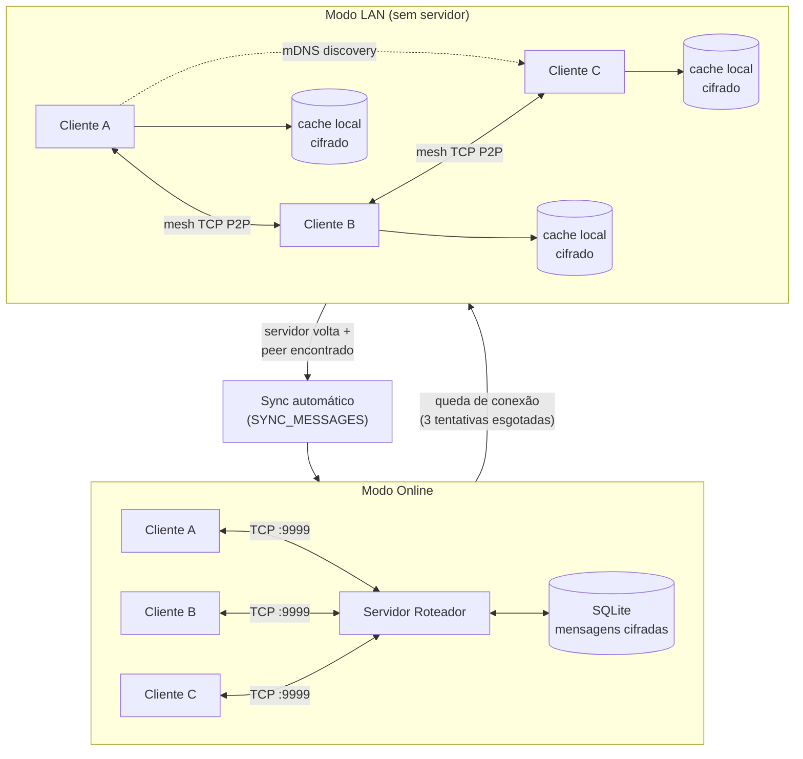
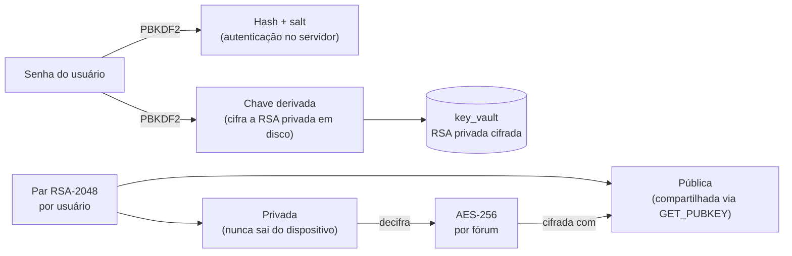
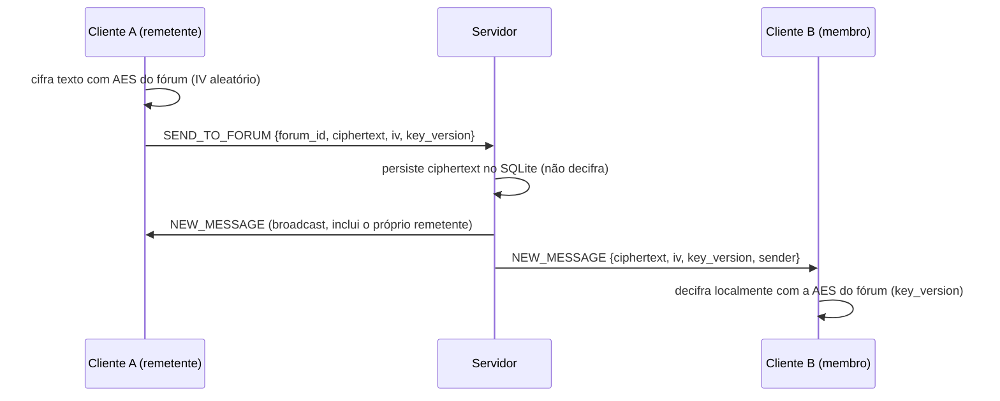
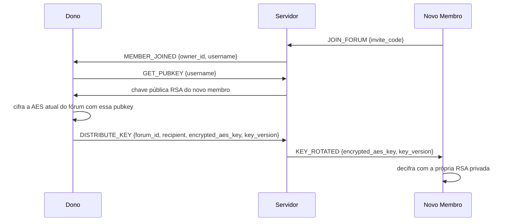

# 🜲 Arquitetura — Corvo Negro

> Diagramas em Mermaid (renderizam nativamente no GitHub) cobrindo os dois
> modos de operação, o fluxo criptográfico ponta-a-ponta e o ciclo de
> sincronização entre eles.

---

## Visão geral

Dois modos de operação:

- **Online:** clientes ⇄ servidor TCP central (roteador) ⇄ SQLite (ciphertext).
- **LAN:** ao cair a conexão com o servidor, os clientes na mesma rede local
  se descobrem via mDNS e continuam conversando em mesh P2P, cada um
  conectado diretamente aos peers com quem compartilha ao menos um fórum.



---

## Camadas de criptografia

1. **Autenticação** — SHA-256 + PBKDF2 (salt por usuário). O servidor nunca
   vê a senha em claro nem a recupera; só compara hashes.
2. **Troca de chaves** — RSA-2048 com padding OAEP. Cada usuário tem um par
   de chaves; a privada é cifrada em disco com uma chave derivada da senha
   (`client/storage/key_vault.py`) e nunca trafega pela rede.
3. **Sessão** — AES-256-CBC, uma chave por fórum (ou por handshake 1:1 nas
   mensagens diretas), com IV aleatório por mensagem.
4. **Identidade em modo LAN** — RSA-PSS (assinatura, não OAEP) prova posse
   da chave privada durante o handshake do mesh, evitando que um peer se
   passe por outro usuário na rede local.



---

## Fluxo de uma mensagem em grupo (modo online)



O servidor **nunca** tem acesso ao conteúdo em claro — só roteia bytes.

## Distribuição e rotação da chave AES do fórum

O servidor nunca gera nem decifra a chave do fórum; quem controla a
distribuição é sempre o dono.



Quando um membro **sai** do fórum, o fluxo é análogo, mas o dono gera uma
**nova** AES (incrementa `key_version`) e redistribui para cada membro
restante — mensagens antigas continuam legíveis com a `key_version` que
tinham no momento em que foram enviadas.

---

## Modo LAN: descoberta e handshake

```mermaid
sequenceDiagram
    participant A as Cliente A
    participant mDNS as mDNS/Zeroconf
    participant B as Cliente B

    Note over A,B: Ambos perderam conexão com o servidor (3 tentativas esgotadas)
    A->>mDNS: anuncia serviço _corvonegro._tcp.local (user_id, forums, porta)
    B->>mDNS: anuncia serviço _corvonegro._tcp.local (user_id, forums, porta)
    mDNS-->>A: notifica serviço de B
    mDNS-->>B: notifica serviço de A
    A->>B: TCP connect + handshake {user_id, forums, nonce, signature}
    B->>B: verifica assinatura RSA-PSS com a pubkey recebida
    B->>A: handshake de resposta (mesma estrutura)
    A->>A: verifica assinatura de B
    Note over A,B: overlap de fóruns > 0 → conexão mantida; senão, socket fechado
    A->>B: MESH_MESSAGE {ciphertext, iv, uuid, origin_timestamp} (por fórum em comum)
```

Sem overlap de pelo menos um fórum, a conexão é encerrada — não há motivo
para manter um socket P2P entre dois usuários sem canal em comum.

## Sync ao voltar para o modo online

```mermaid
sequenceDiagram
    participant C as Cliente
    participant S as Servidor

    Note over C: ClientBridge reconecta com sucesso
    C->>C: monta payload: last_seen (por fórum) + pending (mensagens não sincronizadas)
    C->>S: SYNC_MESSAGES {last_seen, pending}
    S->>S: para cada pending: INSERT OR IGNORE por uuid (dedup)
    S->>S: broadcast NEW_MESSAGE dos uuids realmente novos para membros online
    S->>S: monta new_messages: mensagens do servidor com id > last_seen
    S->>C: {new_messages, accepted_uuids}
    C->>C: grava new_messages no cache local; marca accepted_uuids como synced
    C->>C: exibe histórico ordenado por origin_timestamp
```

Resolução de conflitos: **last-write-wins por `origin_timestamp`** — como
mensagens têm `uuid` único gerado na origem e nunca são editadas, não há
conteúdo para mesclar, só ordem de exibição a resolver (ver
`docs/decisions.md`, 2026-07-19).

---

## Stack por camada

| Camada | Responsabilidade |
|---|---|
| `shared/protocol.py` | Framing TCP (`[4B tamanho][JSON]`), constantes de comando/evento |
| `shared/crypto_utils.py` | Primitivas RSA/AES/PBKDF2/assinatura, usadas por cliente e servidor |
| `server/` | Roteador TCP threaded, persistência SQLite, checagem de permissões |
| `client/network/` | `CorvoClient` (socket 1:1 com servidor), `ClientBridge` (ponte pra GUI), `MeshPeerManager`/`LanAdvertiser`/`LanBrowser` (modo LAN), `ConnectionManager` (orquestra a transição online↔LAN) |
| `client/storage/` | `key_vault` (RSA privada cifrada em disco), `LocalDB` (cache de histórico cifrado campo-a-campo) |
| `client/ui/` | `customtkinter` — janelas, chat, modais de fórum/roles |
